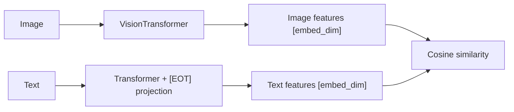
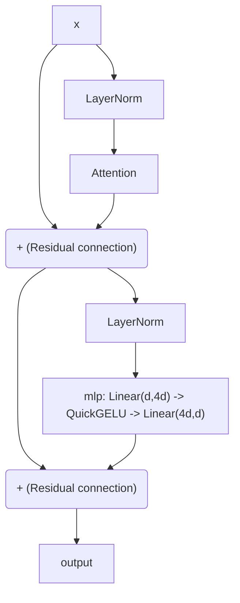
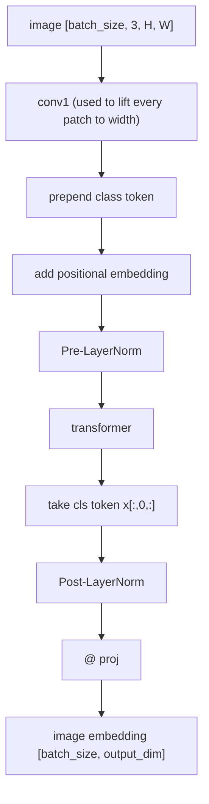
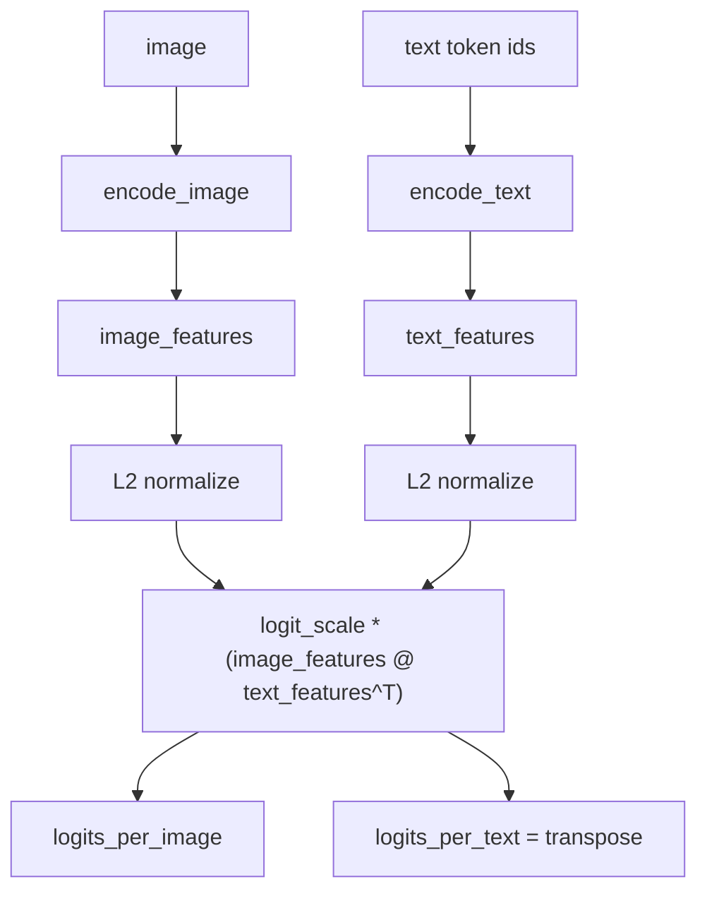
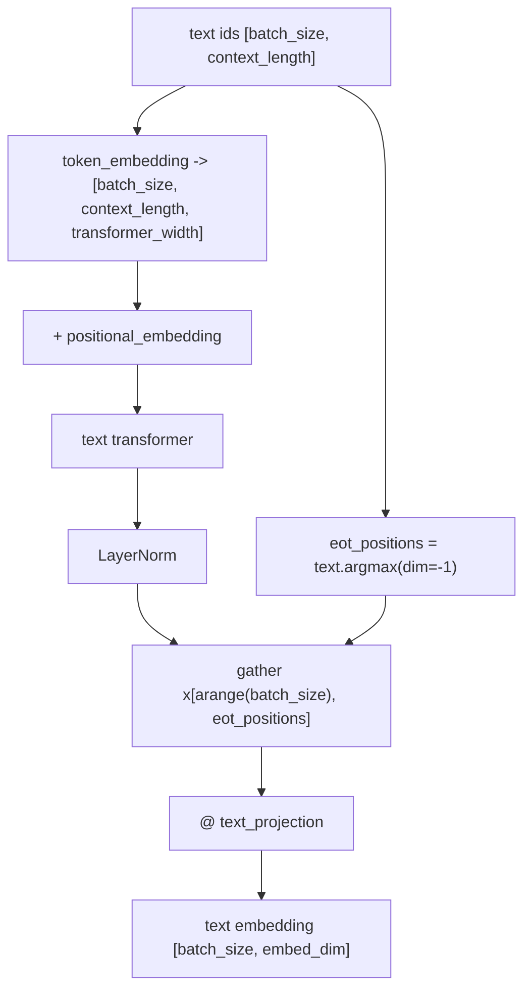

# Programming Practical 3: Zero-Shot Classification with CLIP

This Programming Practical focuses on implementing and using **CLIP** (Contrastive Language-Image Pre-Training), a multimodal model trained by OpenAI that learns to align images and text in a shared embedding space. After completing the missing parts of `model.py`, you will use `classify.py` to classify images with free-form text labels — without any task-specific fine-tuning — and then evaluate the model on CIFAR-100.

The code is a flat version of [openai/CLIP](https://github.com/openai/CLIP), adapted for the practical. The original paper is: Radford et al., *Learning Transferable Visual Models From Natural Language Supervision*, ICML 2021.

## Setup

Start with updating your local repo:

```bash
git fetch upstream
git merge upstream/main
```

And install the additional dependencies

```bash
uv sync --group student
```
## Architecture Overview

CLIP consists of two separate encoders that project their inputs into a **shared embedding space** of fixed dimension (e.g., 512 for ViT-B/32):



Training minimises a **contrastive loss**: for a batch of N (image, text) pairs, it maximises the cosine similarity of the N matching pairs and minimises it for the N²−N non-matching ones. This gives CLIP a remarkable zero-shot ability: to classify an image, you simply compare its embedding against the embeddings of all class name prompts.

The vision encoder can be either a **Vision Transformer (ViT)** or a **modified ResNet**. In this practical the default is `ViT-B/32` (patch size 32, 12 transformer blocks, 512-dim output).

---

## Complete the Missing Parts

In this PP you will implement the core transformer components of `model.py`. Start by reading the full file to understand the overall structure.

---

### `ResidualAttentionBlock`

**What it does:** one complete transformer block. It applies two sub-layers in sequence, each preceded by a LayerNorm (pre-norm variant) and followed by a residual connection:

1. **Multi-head self-attention** — `self.attn` (provided) with causal mask for text, no mask for vision.
2. **MLP** — expand by 4× with `QuickGELU`, then project back.



In `model.py`, the `__init__` contains:

```python
def __init__(self, d_model: int, n_head: int, attn_mask: torch.Tensor = None):
    super().__init__()

    self.attn = nn.MultiheadAttention(d_model, n_head)
    self.ln_1 = LayerNorm(d_model)

    c_fc   = # TODO: nn.Linear from d_model to d_model * 4 (the MLP expansion layer)
    c_proj = # TODO: nn.Linear from d_model * 4 back to d_model (the MLP projection layer)
    self.mlp = nn.Sequential(OrderedDict([
        ("c_fc",   c_fc),
        ("gelu",   QuickGELU()),
        ("c_proj", c_proj)
    ]))
    self.ln_2 = LayerNorm(d_model)
    self.attn_mask = attn_mask
```

- Complete `c_fc`: a `nn.Linear` expanding from `d_model` to `d_model * 4`.
- Complete `c_proj`: a `nn.Linear` projecting back from `d_model * 4` to `d_model`.

The `forward` contains:

```python
def forward(self, x: torch.Tensor):
    x = # TODO: attention sub-layer with residual and layer norm
    x = # TODO: MLP sub-layer with residual and layer norm
    return x
```

- Each sub-layer follows the **pre-norm residual** pattern: apply LayerNorm first, then the sub-layer, then add the residual.
- Use `self.attention(...)` (the provided helper that handles the causal mask) for the attention call.

Before moving to the next section, run 
```bash
uv run python test.py --resattention
```
This checks that your `ResidualAttentionBlock` implementation runs and returns the expected output shape `(sequence_length, batch_size, d_model)`.

---

### `VisionTransformer`

**What it does:** the ViT image encoder used for all `ViT-B/32`, `ViT-B/16`, and `ViT-L/14` variants. The forward pass has four conceptual steps:

1. **Patch embedding** — a `Conv2d` with `kernel_size=stride=patch_size` turns the image into a grid of patch embeddings (already done: `self.conv1`).
2. **Prepend class token** — a learnable `[CLS]` embedding is concatenated at position 0. Its output after the transformer carries the global image representation.
3. **Add positional embeddings** — learned absolute position embeddings are added to the sequence.
4. **Transformer + projection** — the sequence goes through `self.transformer`; then `[CLS]` output is normalised and projected to `output_dim`.



In `model.py`, the `forward` contains:

```python
def forward(self, x: torch.Tensor):
    x = self.conv1(x)  # shape = [batch_size, width, grid, grid]
    x = x.reshape(x.shape[0], x.shape[1], -1)  # shape = [batch_size, width, grid ** 2]
    x = x.permute(0, 2, 1)  # shape = [batch_size, grid ** 2, width]
    class_embedding = self.class_embedding.to(x.dtype) + torch.zeros(
        x.shape[0], 1, x.shape[-1], dtype=x.dtype, device=x.device
    )
    x = # TODO: prepend class_embedding as the first token using torch.cat
    #   concatenate along dim=1. Output shape: [batch_size, grid**2 + 1, width]
    x = # TODO: add self.positional_embedding to x (cast positional_embedding to x.dtype)
    x = self.ln_pre(x)

    x = x.permute(1, 0, 2)  # [batch_size, grid ** 2 + 1, width] -> [grid ** 2 + 1, batch_size, width] (required by nn.MultiheadAttention)
    x = self.transformer(x)
    x = x.permute(1, 0, 2)  # [grid ** 2 + 1, batch_size, width] -> [batch_size, grid ** 2 + 1, width]

    x = # TODO: apply self.ln_post to the class token only (position 0: x[:, 0, :])
    if self.proj is not None:
        x = # TODO: project x to output_dim using self.proj (matrix multiply: x @ self.proj)
    return x
```

- For the class token: `self.class_embedding` has shape `(width,)`. Broadcast it to `(batch, 1, width)` by adding zeros of the right shape, then `torch.cat` with the patch tokens along `dim=1`.
- Add `self.positional_embedding` (shape `[grid**2 + 1, width]`) to the sequence; cast it to `x.dtype` for fp16 compatibility.
- After the transformer, extract only position `0` (the `[CLS]` token) and apply `self.ln_post`.
- Project with `self.proj` using a matrix multiply (`@`).

Before moving to the next section, run 
```bash
uv run python test.py --vit
```
This verifies that your `VisionTransformer` forward pass runs and produces output with the expected shape `(batch_size, output_dim)`.

---

### `CLIP`

**What it does:** the full dual-encoder model. It orchestrates `self.visual` (the vision tower) and `self.transformer` (the text encoder), and exposes three methods:

- `encode_image` — runs an image through the vision tower.
- `encode_text` — runs token ids through the text transformer, extracts the `[EOT]` position, and projects.
- `forward` — normalises both feature vectors, computes the scaled cosine similarity matrix, and returns `(logits_per_image, logits_per_text)`.



#### `encode_text`

!!! Important Note 
    This function takes `text` as input, which is a sequence of tokens of size `context_length`. The input text is supposed to be < `context_length`: the EOT token, which is the last token of the vocabulary is added at the end and then the sequence is padded with token ID 0 to achieve `context_length`. For instance, if the input text is `[23, 45, 12]`and  `context_length`=5, then `text`=`[23, 45, 12, 49999, 0]` for a vocabulary of size 50000.


```python
def encode_text(self, text):
    x = self.token_embedding(text).type(self.dtype)  # [batch_size, context_length, transformer_width]

    x = # TODO: add self.positional_embedding to x (cast to self.dtype)
    x = x.permute(1, 0, 2)  # [batch_size, context_length, transformer_width] -> [context_length, batch_size, transformer_width]
    x = self.transformer(x)
    x = x.permute(1, 0, 2)  # [context_length, batch_size, transformer_width] -> [batch_size, context_length, transformer_width]
    x = self.ln_final(x).type(self.dtype)

    # take features from the eot embedding (eot_token is the highest number in each sequence)
    x = # TODO: index x at the EOT position for each sequence, then project with self.text_projection
    #   Hint: text.argmax(dim=-1) gives the position of the highest token id (= EOT) in each row.
    #   Use x[torch.arange(x.shape[0]), ...] to gather those positions, then matrix-multiply by
    #   self.text_projection.

    return x
```

- Add `self.positional_embedding` (cast to `self.dtype`) to the token embeddings.
- After the transformer, gather the output at the `[EOT]` position. The `[EOT]` token is always the highest token id in the sequence, so `text.argmax(dim=-1)` gives its index for each sample. Use advanced indexing: `x[torch.arange(batch_size), eot_positions]`.
- Project the gathered vector with `self.text_projection` (matrix multiply `@`).



#### `forward`

```python
def forward(self, image, text):
    image_features = self.encode_image(image)
    text_features  = self.encode_text(text)

    # normalized features
    image_features = # TODO: L2-normalize image_features along dim=1 (divide by its norm, keepdim=True)
    text_features  = # TODO: L2-normalize text_features  along dim=1

    # cosine similarity as logits
    logit_scale = self.logit_scale.exp()
    logits_per_image = # TODO: logit_scale * image_features @ text_features.t()
    logits_per_text  = # TODO: transpose of logits_per_image

    return logits_per_image, logits_per_text
```

- L2-normalise both feature vectors so that their dot product equals the cosine similarity. Use `tensor / tensor.norm(dim=1, keepdim=True)`.
- `logit_scale` is a learned temperature parameter; `self.logit_scale.exp()` converts the log-scale parameter to a positive scalar.
- `logits_per_image[i, j]` is the scaled cosine similarity between image `i` and text `j`. `logits_per_text` is simply its transpose.

Before moving to the next section, run

```bash
uv run python test.py --clip
```
 This checks that the full `CLIP` forward pass runs and that both outputs have the expected shape `(batch_size, batch_size)`.

---

## Zero-Shot Classification On Any Image

Once you have completed the implementation, use `classify.py` to test your model by doing zero-shot classification on your own images. Find an image of your choice and try to zero-shot-classify it!


### Basic Usage

```bash
# Provide custom labels
uv run python classify.py --image_path="photo.jpg" --labels="['a cat','a dog','a car','a bicycle']"

# Change the prompt template
uv run python classify.py --image_path="photo.jpg" --prompt_template="this is a picture of {}"
```

### CLI Options

All configuration variables can be overridden from the command line with `--key=value`:

| Option | Default | Description |
|--------|---------|-------------|
| `--image_path` | `None` | Path to the input image **(required)** |
| `--labels` | 10 common classes | Python list of candidate label strings |
| `--prompt_template` | `"a photo of {}"` | Template used to wrap each label; `{}` is replaced by the label |
| `--device` | `"cpu"` | PyTorch device: `"cpu"`, `"cuda"`, `"cuda:0"`, … |

---

## Zero-Shot Classification on CIFAR-100

`eval_cifar100.py` evaluates your CLIP implementation on [CIFAR-100](https://www.cs.toronto.edu/~kriz/cifar.html): 100 fine-grained classes, 10 000 test images (32×32, upscaled to the model's input resolution).

CIFAR-100 is downloaded automatically the first time you run the script.

CLIP can classify images it has never seen during fine-tuning, using only the class names as text prompts, hence the name "Zero-shot classification".

### Complete `eval_cifar100.py`

As with `model.py`, some lines in `eval_cifar100.py` are intentionally left as TODOs. Complete the zero-shot evaluation pipeline:

```python
with torch.no_grad():
    # TODO:
    # 1. Encode text
    # 2. Normalize encodings


with torch.no_grad():
    for images, labels in tqdm(test_loader, desc="Zero-shot"):
        images = images.to(device)
        labels = labels.to(device)

        # TODO:
        # 1. Encode images
        # 2. Normalize encodings
        # 3. Compute logits with Cosine Similarity using text_features,
        # images_features and logit_scale=model.logit_scale.exp()
        # Get the pred id (preds)
        n_correct += (preds == labels).sum().item()
        n_total += images.size(0)

zs = n_correct / n_total * 100
print(f"\nZero-shot on CIFAR-100 test set ({n_total} images):")
print(f"  Top-1 accuracy: {zs:.2f}%")
```

- In the first `torch.no_grad()` block, compute text features.
- Then L2-normalise text features.
- In the per-batch loop, encode and normalise image features.
- Compute logits
- Get top-1 class predictions with `argmax(dim=1)`.


Internally, the script:

1. Encodes all 100 class name prompts (e.g., `"a photo of an apple, a type of fruit or vegetable."`) through the text encoder → 100 text feature vectors.
2. For each test image, encodes it through the vision encoder → 1 image feature vector.
3. Computes cosine similarities between the image and all 100 text vectors.
4. Predicts the class with the highest similarity.

```bash
uv run python eval_cifar100.py
```

If running the full CIFAR-100 test set takes too long on your machine, use `--num_samples` to evaluate on a smaller subset:

```bash
uv run python eval_cifar100.py --num_samples=1000
```

Expected accuracy for `ViT-B/32` (from the CLIP paper): **≈ 65.1% top-1**.


### Effect of prompt template

Play with the prompt template to see how it affects accuracy:

```bash
uv run python eval_cifar100.py --prompt_template="a photo of a {}."
uv run python eval_cifar100.py --prompt_template="{}"
```

## Already Done?

You can finish the CLIP-related notebooks from the last PP:

Notebook: [](https://colab.research.google.com/github/paulnovello/Advanced-AI/blob/main/PP2%3A%20Vision/CLIP.ipynb)

Solution: [](https://colab.research.google.com/github/paulnovello/Advanced-AI/blob/main/PP2%3A%20Vision/clip_solution.ipynb)

## Still Some Time Left?

You can try classification with linear probing. Try to fit Cifar100 with a Logistic Regression on the image embedding space.

Do not use the full training dataset (it will take too long). Fit your dataset on 10000 train images (and adjust if needed).

## Please take the time to give feedback!

Please fill out the [feedback form](https://docs.google.com/forms/d/e/1FAIpQLSd4qRiPho43N8hZEpKEBhLpUe0W-wOoYNQRZj24-elrwj3esA/viewform?usp=publish-editor) to help us improve future practical sessions!